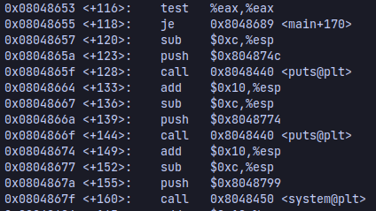

# Favorite Color
|Info           |Description                    |
|---------------|-------------------------------|
|Type           |pwn                            |
|Rating         |60 points                      |
|Link           |[Favorite Color](https://ctflearn.com/challenge/391)|

## Description
```
What's your favorite color? Would you like to share with me? Run the command: `ssh color@104.131.79.111 -p 1001` (pw: guest) to tell me!
```

## Solution
This is a classic ROP problem, we have to return from `vuln` straight to `main+120` to open the terminal. Using De Bruijn sequence, i found out that EIP is located 53 bytes after the buffer.



## Flag
```
flag{c0lor_0f_0verf1ow}
```