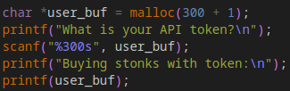

# Stonks

|Info           |Description                    |
|---------------|-------------------------------|
|Type           |pwn                            |
|Rating         |20 points                      |
|Link           |[Stonks](https://play.picoctf.org/practice/challenge/105?category=6&page=1&solved=0)|

## Description

```txt
I decided to try something noone else has before. I made a bot to automatically trade stonks for me using AI and machine learning. I wouldn't believe you if you told me it's unsecure! vuln.c nc mercury.picoctf.net 33411
```

Hints:
<details>
    <summary>1</summary>
    Okay, maybe I'd believe you if you find my API key.
</details>

## Solution

`buy_stonks` contains a format-string vulnerability, so we can use it to leak the API key. By bruteforcing, i found the `api_buf` location at the 15th place from the top of the stack.



## Flag

```txt
picoCTF{I_l05t_4ll_my_m0n3y_a24c14a6}
```

